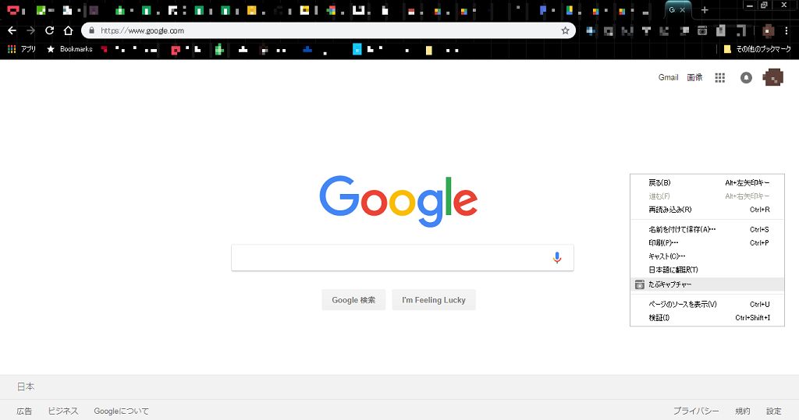
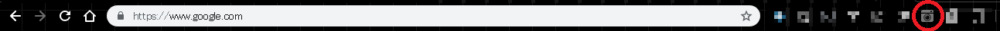
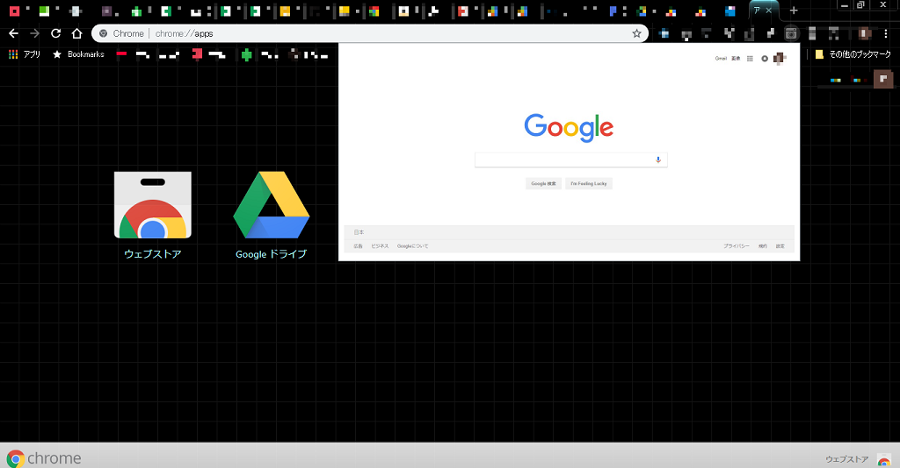

# たぶキャプチャー

ブラウザの任意のタブをキャプチャーし、アイコンクリックによりキャプチャーした画像をポップアップで表示するChrome拡張機能です。
ポップアップ画像はキャプチャー元のページへのリンクとなっています。

## 使い方

1. タブの画像キャプチャーをとる

キャプチャーしたいタブを選択し右クリック→「たぶキャプチャー」を選択
（画面に表示されている範囲しかキャプチャーされません）

2. キャプチャー画像の表示

Chromeメニュー上の「たぶキャプチャー」アイコンクリックでキャプチャーした画像を表示

ポップアップ画像はキャプチャー元のページへのリンクとなっています。
